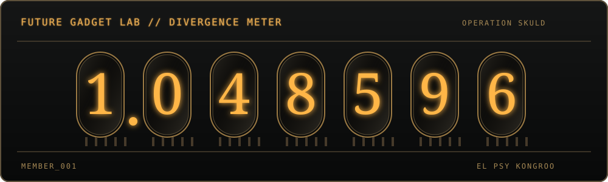

<!-- 

  

 -->
<!-- 

  

 -->

<table align="center">
  <tr>
    <td>
      
    </td>
        <td align="center">
      <h1>Member 001: Leclouch</h1>
      <i>Okabe Rintarou wannabe · building things across a few world lines</i>
    </td>
  </tr>
</table>

  

## Lab Notes

> The Organization insists this is a GitHub profile. I insist it is a record of experiments, questionable ideas, and projects that escaped the microwave.

- 🧪 Currently conducting experiments in software, mobile, cloud, and machine learning.
- 🛰️ Building one commit at a time until the divergence meter moves.
- 📟 Status: no time machine yet. The bugs, however, are very real.

## Lab Equipment

  

## Flagship Experiments

### R2 — ABU Robocon 2026

Computer-vision programmer for an autonomous Kung Fu Quest robot. I build its perception and visual-servoing stack with **Jetson Orin Nano**, **ROS 2**, **RealSense D435i**, and **micro-ROS**—so the robot can see the target before the rest of the system goes somewhere questionable.

### PelletQ-AI

Deterministic fish-feed formulation and pellet-production automation for a catfish farmer. Built with **Next.js**, **TypeScript**, **Prisma**, **ESP32**, and **MQTT**; the LP solver, SNI validator, and rule engine make the decisions. The LLM only explains them—no AI hallucinations in the fish feed.

### TemanKu

Guardian-mediated AI micro-games for Indonesian neurodivergent K–12 students. Built with **Flutter**, on-device vision, and constrained speech recognition, with a calm child experience and a separate, practical guardian view.

> `wfhomelab` transmission received: Ubuntu Server · self-hosting experiments · Telegram assistant: Amane.

## Divergence Meter

  
  

  

<!-- 

  

 -->

<!-- ## World Line Activity -->

---

<i>El Psy Kongroo.</i>

